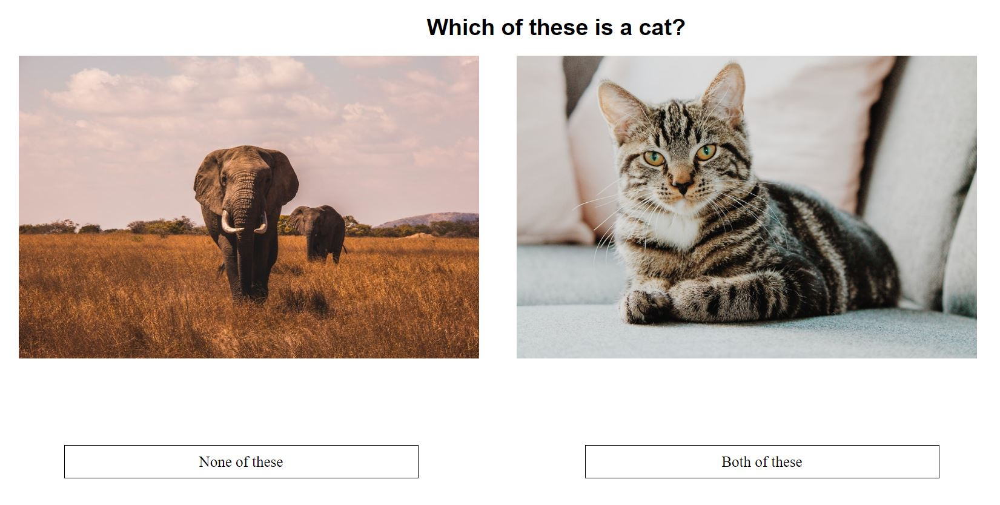
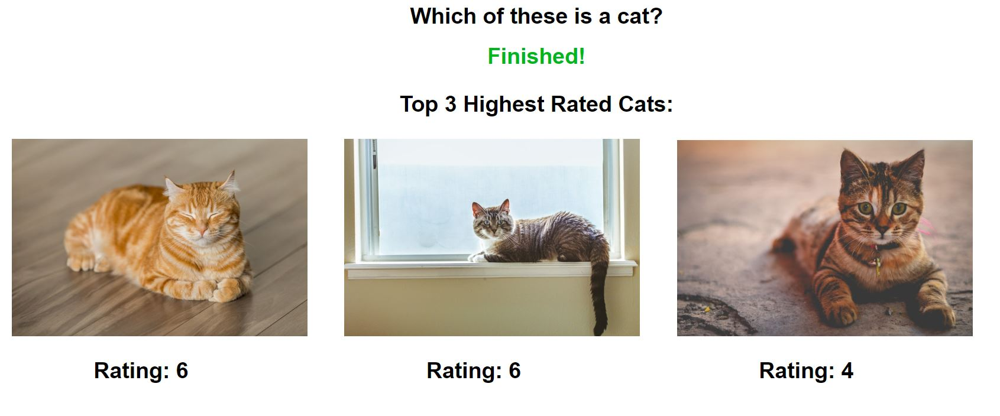

# [Which is my cat?](http://gorgeous-pump.surge.sh/)




> A front end app created using React for simulating a web UI that could be used for training an ML model using supervised learning.

---

### Table of Contents

- [Description](#description)
- [Installation](#installation)
- [License](#license)
- [Info](#info)

---

## Description

The aim of this assignment is to get help from the user to train a dataset of images and correctly tag the images of cats. You can store up to 20 to 30 images in an /images folder in your codebase. Some of these images will be actual cat photos and others need to be of random objects. You need to get the user to click on actual cat images and then rate those images accurately based on the user feedback. When you shuffle through all the images, at the end, you will need to show the images to the user with the most ratings.


Have a look at the Live version [here](http://gorgeous-pump.surge.sh/).

#### Technologies

- React

---

## Installation

#### `Step 1` - Clone the repo

```bash
$ git clone https://github.com/roheat/indorse-cats.git
```

#### `Step 2` - cd in the repo

```bash
$ cd indorse-cats
```

#### `Step 3` - Install dependencies

```bash
$ npm install
```

#### `Step 4` - Run application

```bash
$ npm start
```

In browser, open [http://localhost:3000](http://localhost:3000)

---

## License

MIT © [roheat](https://github.com/roheat)

---

## Info

- Website - [roheat.com](https://roheat.com)
- Twitter - [@roheatdotcom](https://twitter.com/roheatdotcom)
- LinkedIn - [Rohith Srivathsav](https://www.linkedin.com/in/rohith-srivathsav/)
